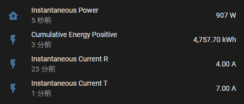
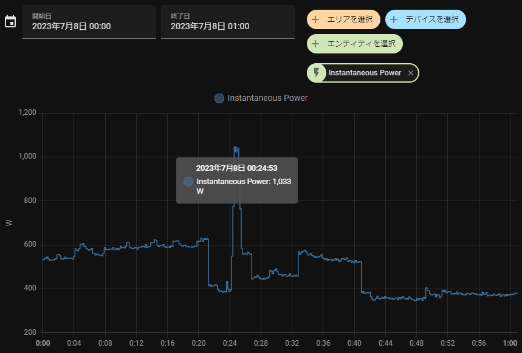
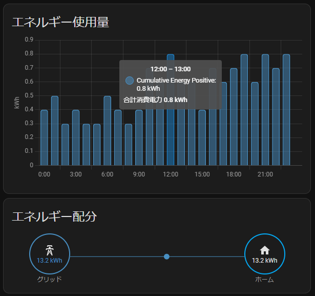
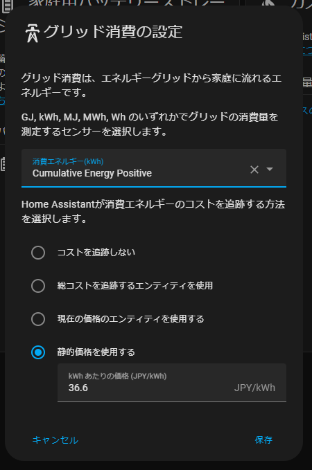

# ESP32 B Route to MQTT Smart Meter

M5StickCからWi-SUNアダプタでスマートメーターにアクセスし以下のプロパティを(ほぼ)リアルタイムに取得してMQTT BrokerにPublishする

* 瞬時電力計測値
* 瞬時電流計測値(T相)
* 瞬時電流計測値(R相)
* 積算電力量計測値(正方向)
* 係数
* 積算電力量単位

Home Assistantの[Energy Management](https://www.home-assistant.io/docs/energy/)で[Electricity Grid](https://www.home-assistant.io/docs/energy/electricity-grid/)として振る舞うことができるようになる

## Requirements

* Bルートの開通手続き
* [M5StickC](https://www.switch-science.com/products/6470)
* [BP35A1 Wi-SUN Module](https://www.rohm.co.jp/products/wireless-communication/specified-low-power-radio-modules/bp35a1-product)
* [Wi-SUN HAT](https://www.switch-science.com/products/7612)
* MQTT Broker (e.g. [Mosquitto](https://mosquitto.org))
* MQTT Subscriber (e.g. [Home Assistant](https://www.home-assistant.io))

## Install

1. MQTT Brokerを立てておく
2. [`_SmartMeterConfig.h`](include/_SmartMeterConfig.h)を`SmartMeterConfig.h`にリネームして設定する
3. ファームウェアをビルドして起動する
4. しばらくすると取得値をシリアルに出力する
5. BrokerやSubscriberのログを見てPublishできてることを確認する

## MQTT Subscriber (Home Assistants)





### configuration.yaml

Home Assistantには[MQTT Sensor](https://www.home-assistant.io/integrations/sensor.mqtt/)として登録する

```yaml
mqtt:
  sensor:
    - state_topic: "SmartMeter/Power/Instantaneous"
      unique_id: instantaneous_power
      name: "Instantaneous Power"
      device_class: power
      unit_of_measurement: W
      state_class: measurement
      icon: mdi:flash
    - state_topic: "SmartMeter/Energy/Cumulative/Positive"
      unique_id: cumulative_energy
      name: "Cumulative Energy Positive"
      device_class: energy
      unit_of_measurement: kWh
      state_class: total_increasing
      icon: mdi:flash
    - state_topic: "SmartMeter/Current/Instantaneous/R"
      unique_id: instantaneous_current_r
      name: "Instantaneous Current R"
      device_class: current
      unit_of_measurement: A
      state_class: measurement
      icon: mdi:flash
    - state_topic: "SmartMeter/Current/Instantaneous/T"
      unique_id: instantaneous_current_t
      name: "Instantaneous Current T"
      device_class: current
      unit_of_measurement: A
      state_class: measurement
      icon: mdi:flash
```

### Energy Management - Electricity Grid

積算電力量計測値をElectricity Gridとして登録すると消費電力やコストが追跡できるようになる



## ESP32 Log
### Level 3 (Info)

```
[ 87618][I][main.cpp:101] setup(): ConvertCumulativeEnergyUnit : 0.100000
[ 87619][I][main.cpp:102] setup(): SyntheticTransformationRatio: 1
[ 91834][I][main.cpp:119] loop(): InstantaneousPower       : 767 W
[ 91834][I][main.cpp:120] loop(): CumulativeEnergyPositive : 4757.399902 kWh
[ 91836][I][main.cpp:121] loop(): InstantaneousCurrentR    : 4.000000 A
[ 91842][I][main.cpp:122] loop(): InstantaneousCurrentT    : 5.000000 A
[106568][I][main.cpp:119] loop(): InstantaneousPower       : 787 W
[106568][I][main.cpp:120] loop(): CumulativeEnergyPositive : 4757.399902 kWh
[106569][I][main.cpp:121] loop(): InstantaneousCurrentR    : 4.000000 A
[106576][I][main.cpp:122] loop(): InstantaneousCurrentT    : 5.000000 A
```

### Level 5 (Debug)

```
[  7589][D][BP35A1.cpp:39] initialize(): Sk status uninitialized.
[  7590][D][BP35A1.cpp:171] configuration(): Initialize status uninitialized.
[  7591][D][BP35A1.cpp:24] execCommand(): >> SKTERM
[  7597][D][BP35A1.cpp:24] execCommand(): >> SKRESET
[  7602][D][BP35A1.cpp:24] execCommand(): >> SKSREG SFE 0
[  7607][D][BP35A1.cpp:24] execCommand(): >> SKVER
[  8211][D][BP35A1.cpp:228] waitResponse(): << OK
[  8212][D][BP35A1.cpp:228] waitResponse(): << SKSREG SFE 0
[  8212][D][BP35A1.cpp:228] waitResponse(): << OK
[  8214][D][BP35A1.cpp:228] waitResponse(): << EVER 1.2.10
[  8725][D][BP35A1.cpp:39] initialize(): Sk status uninitialized.
[  8725][D][BP35A1.cpp:186] configuration(): Initialize status getSkVer.
[  8726][D][BP35A1.cpp:24] execCommand(): >> SKSETPWD C XXXXXXXXXXXXXXXX
[  8735][D][BP35A1.cpp:228] waitResponse(): << OK
[  9241][D][BP35A1.cpp:39] initialize(): Sk status uninitialized.
[  9242][D][BP35A1.cpp:191] configuration(): Initialize status setSkSetpwd.
[  9243][D][BP35A1.cpp:24] execCommand(): >> SKSETRBID XXXXXXXXXXXXXXXXXXXXXXXXXXXXXXXXXXXX
[  9255][D][BP35A1.cpp:228] waitResponse(): << OK
[  9759][D][BP35A1.cpp:44] initialize(): Sk status scanning.
[  9760][D][BP35A1.cpp:124] scan(): Scan status uninitialized.
[  9760][D][BP35A1.cpp:24] execCommand(): >> SKSCAN 2 FFFFFFFF 3
[  9767][D][BP35A1.cpp:228] waitResponse(): << OK
[ 10273][D][BP35A1.cpp:44] initialize(): Sk status scanning.
︙
[111503][D][BP35A1.cpp:303] sendUdpData(): >> SKSENDTO 1 XXXX:XXXX:XXXX:XXXX:XXXX:XXXX:XXXX:XXXX 0E1A 1 0012 1081020005FF010288016203E700E800E000
[111515][D][BP35A1.cpp:228] waitResponse(): <<
[111720][D][BP35A1.cpp:228] waitResponse(): << EVENT 21 XXXX:XXXX:XXXX:XXXX:XXXX:XXXX:XXXX:XXXX 00
[111720][D][BP35A1.cpp:228] waitResponse(): << OK
[115325][D][BP35A1.cpp:228] waitResponse(): << ERXUDP XXXX:XXXX:XXXX:XXXX:XXXX:XXXX:XXXX:XXXX XXXX:XXXX:XXXX:XXXX:XXXX:XXXX:XXXX:XXXX 0E1A 0E1A XXXXXXXXXXXXXXXXXX 1 001E 1081020002880105FF017203E704000003A1E80400460028E0040000B9D7
[115342][I][main.cpp:119] loop(): InstantaneousPower       : 929 W
[115343][I][main.cpp:120] loop(): CumulativeEnergyPositive : 4757.500000 kWh
[115346][I][main.cpp:121] loop(): InstantaneousCurrentR    : 4.000000 A
[115353][I][main.cpp:122] loop(): InstantaneousCurrentT    : 7.000000 A
```

## mosquitto Log

```
1689000942: Received PINGREQ from ESPSmartMeter
1689000942: Sending PINGRESP to ESPSmartMeter
1689000946: Received PUBLISH from ESPSmartMeter (d0, q0, r0, m0, 'SmartMeter/Power/Instantaneous', ... (3 bytes))
1689000946: Sending PUBLISH to 2gFmQuKY7ClfRO0o7q34vt (d0, q0, r0, m0, 'SmartMeter/Power/Instantaneous', ... (3 bytes))
1689000946: Received PUBLISH from ESPSmartMeter (d0, q0, r0, m0, 'SmartMeter/Energy/Cumulative/Positive', ... (7 bytes))
1689000946: Sending PUBLISH to 2gFmQuKY7ClfRO0o7q34vt (d0, q0, r0, m0, 'SmartMeter/Energy/Cumulative/Positive', ... (7 bytes))
1689000946: Received PUBLISH from ESPSmartMeter (d0, q0, r0, m0, 'SmartMeter/Current/Instantaneous/R', ... (4 bytes))
1689000946: Sending PUBLISH to 2gFmQuKY7ClfRO0o7q34vt (d0, q0, r0, m0, 'SmartMeter/Current/Instantaneous/R', ... (4 bytes))
1689000946: Received PUBLISH from ESPSmartMeter (d0, q0, r0, m0, 'SmartMeter/Current/Instantaneous/T', ... (4 bytes))
1689000946: Sending PUBLISH to 2gFmQuKY7ClfRO0o7q34vt (d0, q0, r0, m0, 'SmartMeter/Current/Instantaneous/T', ... (4 bytes))
```